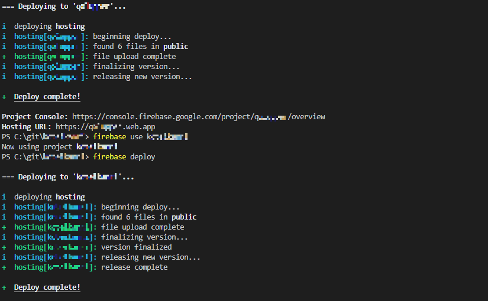

既存のプロジェクトと同じ構成(自分はvue)の開発を進めたい時、
cloneしてきたプロジェクトのデプロイ先は以前設定していた箇所となっているため、
firebase initした後firebase deployを実施してもデプロイ先は動的に変更されない。

※cloneしてきたディレクトリ名やmain.js等で指定したFirebase SDK snippet等の
　認証を勝手に読んでデプロイ先を変更してくれる等の機能はなく、デプロイ先変更コマンドとして
　明示的に変更して上げる必要がある(SDKはあくまで認証時にのみ使用されるため)

結論： firebase use (ProjectID) を使用することでデプロイ先を変更する

```
git clone https://github.com/xxxxxxxx/yyyyyyyy.git

// 任意の方法で新規プロジェクト名：zzzzzzzにリネームを実施

firebase use zzzzzz
firebase deploy  // zzzzzzにデプロイが実施される
```
<br><br>
実行結果
<br><br>



注意：firebaseのデプロイ先を変更してもFirebaseSDKの設定は動的に変わらないため、
認証等を使用する場合新しく作成したプロジェクトの情報を新しく登録する必要あり。
(※で書いている内容の逆：Firebase機能が使えるかは別途確認すること)