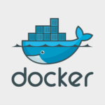
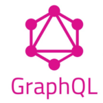

最近Twitterで流れてきて気になった単語。 
単語レベルではすべてシェアがフラットに見えるので、Qiitaの直近一ヶ月記事件数がどれくらいか？ 
というある程度意味のある観点で調べてみて将来的にどうなのか、触れるべきかどうかを考える。 
 
2020/10/23-11/23の記事数を表示。 

# Flutter

Qiita投稿記事　**103**件 
 
iOSとAndroidに対して同じコードでアプリを開発できるフレームワーク。 
JavaScriptに似たDart言語での開発となる。JavaScriptとの違いは[こちら(Quora)](https://jp.quora.com/JavaScript%E3%81%A8Dart%E3%81%AE%E4%B8%BB%E3%81%AA%E9%81%95%E3%81%84%E3%81%AF%E3%81%A9%E3%81%86%E3%81%84%E3%81%A3%E3%81%9F%E7%82%B9%E3%81%A7%E3%81%99%E3%81%8B)参照。 
 
乱暴に言うとTypeScriptの書き方が違うモノ。TypeScriptよりユーザーが少ないので情報が得辛い。 
めちゃくちゃ変わるわけではないので学習コストはそこまで高くないが、JavaScriptだけで 
iOS/Android開発に対応できる<u>React Nativeと比べて以下の問題がある。</u> 

* <u>採用事例がReact Nativeに対し極端に少ない</u>こと
* Dartを覚えてもここでしか使うことがないため、TypeScriptを導入したReact Nativeと比較すると学習効率が悪くなる

※ReactNative採用事例としてFacebookやInstagram、Airbnb等のビッグネームがあるが、 
　FlutterはGoogle以外大手企業での採用事例が少ない。
 
　参考：[モバイルアプリ開発にGoogleのFlutterを使うべき8つの理由](https://goworkship.com/magazine/mobile-apps-google-flutter/) 

### 感想
* Flutterの方がコンパイルが早いらしいのでデカくなればなるほど有利かも
* 単純な案件数で見たとき少ないので、<u>覚えてもそのまま使わない可能性も大</u>
* 採用する案件があったら飛びついて中で勉強させてもらうのはめちゃくちゃ有意義だと思う

# Glide

Qiita投稿記事　**6**件 
 
NoCode開発ツール。GoogleSpreadSheetをデータベースのように使ってwebアプリを作成可。 
GUI操作だけでそれっぽいものが作れるので、構築すればメンテナンス等を企業側ができ 
自社内で使う情報ポータル等を作ってるような採用事例はあるらしい。社内SEなら出番あるかも 
 
参考：[非エンジニアでもできる Glide を使った PWA アプリ開発](https://medium.com/@yonemoto/%E9%9D%9E%E3%82%A8%E3%83%B3%E3%82%B8%E3%83%8B%E3%82%A2%E3%81%A7%E3%82%82%E3%81%A7%E3%81%8D%E3%82%8B-glide-%E3%82%92%E4%BD%BF%E3%81%A3%E3%81%9F-pwa-%E3%82%A2%E3%83%97%E3%83%AA%E9%96%8B%E7%99%BA-9ed8f4b7f7a5)

感想
* 情報表示系ならデバッグ等なしでできそうなので、データを表示してアクセス稼ぐページを作る場合、 
DB構築等が必要ないため開発コストをかなり少なくできる(スクレイピングとの相性が良いかも)
* 用途が明確でない限りコード書ける人間がわざわざ触る意味はあまりない。

# React / Vue

React Qiita投稿記事　**349**件 
Vue Qiita投稿記事　**395**件 
 
VueもReactも現在ではフロントエンドフレームワークとしてかなり使われており、 
Angularと比べて比較的規模感の小さい現場でも導入されていること・マイクロサービスと 
GOの流行感からフロントエンドをやっていこうとすれば避けて通れなさそうな技術になっている。 
 
複雑な処理でなければバックエンドはFirebaseや各企業が提供しているAPIでなんとかなるため、 
個人開発をやりたい場合Vue/Reactさえわかっていれば開発工数を大きく減らすことができ大変便利。 
両者ともSSR / SPA対応できるので、チームのJavaScriptレベルでどちらか選定する感じになりそう。 
 
※以下、Vueはハンズオン程度の知識、Reactは調査レベルの知識前提になります 

## Vue.js

Vueはcomponent単位でhtml/JavaScript/CSSが一つになった.vueファイルが作られ、 
1ページ1ページの処理・コンテンツをまとめて管理できるので開発者が少ない環境であれば 
ファイル移動が少なくシームレスな開発ができそうな感じで良かったと思う。 
 
ただ記法が混ざった.vueファイルが結構癖があって、lintがうまく動かなかったり 
Vueはv-model・v-for等データのバインディングがVueのネイティブ機能で存在しているため 
独自記法になれるまでは多少つらい感じだった。 
 
加えてVueについてはBootStrapのようにパーツ的に扱える素のVue、 
かなり使われているVue CLI2と2018年8月ごろに出たVue CLI3があり、区別する必要がある。 
CLI3ではCLI2で使えていた外部ツールがまだ対応していない、記法が変わっているなど 
ネット上QAも使っているCLIバージョンに対応しているか注意深く見る必要があり、 
超大手が使っているReactと比べると情報の取捨選択は難しくなるかなと思う。 
 
Nuxt(大規模には向いてるが設定が増える)とかVuetify(途中導入するとバージョン違いでコケる)等 
開発パターンにも差があるので1個に入れ込みすぎると現場で全く使わなかった、的な事はあるかも。 

### Vueのまとめ
* component単位で書けるためファイル移動が少なく開発できて楽
* .vueファイルが独自記法のため癖があってなれるまで難しい
* 素Vue/Cli2/Cli3の差がデカく、情報の正確な取捨選択が必要
* 触った感として<u>バージョン差異は少し大変だけど全体的にシームレスな開発の楽さが大きかった</u>。

## React

FaceBook等大手が使っているフロントエンドフレームワーク。 
.vueのような形ではなくJSX記法を用いてJavaScriptでhtmlを出力していく方式。 
 
あまり意識せずにvueを勉強していたが、Reactの記法を見ているとかなりJavaScriptに寄っており 
めちゃくちゃ開発しやすそうなので、先に知っていたらReactから手を付けてたかもしれない。 
 
VueはJava開発をしていたときのJQueryに持っていたイメージと近く、JavaScriptの知識が少なくても 
ドキュメントを読み込めばサクサク進める感じだったが、ReactについてはJavaScript的な書き方が 
必須となるためある程度知識がある前提ならReactの方が発展性があるように感じた。 
(vueだと.vue由来のよくわからないエラーとなるが、ReactだとJSエラーとして解決できるため) 
 
ReactにもReact NativeやNext等のフレームワークがあるため現場での差異吸収は必要だと思うが、 
トータルの知識をJavaScriptレベルに集約できそうなので、勉強のしがいはかなりありそうだった。 
 
※余談レベルだがLineの開発者LTで、現在のデファクトはReact + TypeScriptという話が出ていたため 
　この組み合わせの開発経験については知見もしっかりしておりかなり将来に有利に働くと思う。

### Reactのまとめ
* <u>JavaScript/node的書き方がわかる前提になる</u>が、汎用性・発展性は高そう
* React/ReactNativeの差は未確認だがJSベースなので必要以上の心配はいらなさそう
* これからはTypeScript前提になってくるかも

# Docker

Qiita投稿記事　**675**件

仮想化ツール。2020 lateのMacBookで使えない(新OSのせい？)事が話題(2020/11現在) 
もう流石にモダン開発では必須、常用してない会社に在籍するのは考えるべきだと思う。 
AWS、GCPともにコンテナ運用が主流になっているので、Docker Hubにアップされている 
イメージの組み合わせだけでいろいろな環境を構築できて便利。 
 
Dockerについては使ってる企業と使ってない企業では年収100万前後変わってくるイメージなので 
もしSES系企業から転職する場合は一つのラインとして考えてもいいと思う。 
 
※転職先の技術判断に関して、AWSに関しては準レガシーくらいな企業でも本番用として 
　<u>「ある程度シニアな社員が」</u>使っていたり、各種フレームワークについては相手としている業界で 
　使われているモノが変わってくるため、会社の技術レベルが図りにくい。 
　特に前者は入っても自分がAWSを触れなかったり、シニア社員は残業代で給与が高くなっているため 
　必然的に社内の労働時間が長め、ということがあり得る。(あくまで経験談) 
　社員が全員Dockerを使っている環境は比較的貸与PCのスペックも高く、ECS常用しているケースが 
　考えれられるため、スキルレベルの平均値も高く比例して年収も高くなると思われる。 

### 感想
* 検索件数のベンチマーク的に使用、やはり今では仮想環境の必須知識なのでもう少し慣れたい
* 運用自体は問題ないが<u>構築に対するスキルが今一つのため今後一番身につけたい</u>所
* もう少し個人開発に使っていきたい所はある

# GraphQL

Qiita投稿記事　**46**件 
 
API用に使用するクエリ言語。QL=クエリ言語なのでSQLのWeb版だと考えると理解しやすい。 
RESTApiだと削除はdelete、登録はget/post 等エンドポイントが複数になることに対して、 
GraphQLはエンドポイントを一つにし、飛んできたリクエストをクエリにて処理しJSON返却する。 
 
エンドポイントが増えないため、エンドポイント仕様策定に余分な工数を使ったり 
実装後メンバー間でエンドポイントの仕様差が出てきてしまう等の問題をケアできる。 
(getで登録処理を書いているメンバーがいたり、postで登録処理を書いているメンバーがいたり、等) 
 
ネット上知見が少ないことに加え、以下の問題点が存在する。

* 複雑なクエリになると実装が難しかったりエンドポイントが一つのため分析が難しい
* RESTのHTTPエラーが戻ってくる形と異なり検索ができてしまえば200が戻るため結果解析が必要
* ライブラリがそこまで充実しているわけではないので、連携する機能によっては実装が面倒になる
 
参考：[Web API初心者と学ぶGraphQL](https://qiita.com/SiragumoHuin/items/cc58f456bc43a1be41b4) 
　　　[初心者目線でGraphQLを解説！～同じWebAPIのRESTとの違いは？～](https://vitalify.jp/app-lab/vietnam-offshore/20171006-graphql/#3RESTRESTful) 
　　　[「GraphQL」徹底入門 ─ RESTとの比較、API・フロント双方の実装から学ぶ](https://eh-career.com/engineerhub/entry/2018/12/26/103000) 

### 感想
* 乗り換える場合ライブラリ等を考えるとコスト感が高そうで面倒かも、フルスクラッチならあり？
* <u>よっぽど理由がなければRESTが採用されそう</u>。Flutter(≒Dart)に考え方は似てるかも

# Electron

Qiita投稿記事　**33**件

JavaScriptでデスクトップアプリを作れるフレームワーク。 
採用事例はSlack、Visual Studio Code等。 
JavaScriptでフロント、サーバーサードはできるけどデスクトップアプリは作れないのかな？と思って 
調べたらElectronがあった。以前はWindowsアプリ開発用に別のツール的な物があったらしい。 
 
[QiitaのSlack開発環境分析](https://qiita.com/Masahiro_T/items/4c0476f5ae9314b0e347)を見る限り、バックエンドさえ組めればある程度の物が作れそう。 
デスクトップアプリにする必要があるか？(広告収入は？セキュリティは？等の問題があるので)を 
考え、スタンドアロンで動かす必要がある場合はElectronを勉強する選択肢もいいかなと思った。 
 
ただ他デスクトップツールやデバイスと連携したいみたいなことがなければWebアプリor 
React Nativeで足りるため、個人開発レベルの優先度としては低くてもいいかな、と思った。 
 
参考：[ようこそ！Electron入門](https://qiita.com/umamichi/items/6ce4f46c1458e89c4cfc) 

### 感想
* フロントpureJS、バックエンドnodeでも開発できそうなので、ツール開発したいなら便利かも
* といってもFlutter等の選択肢もあるので、参画する可能性がある案件次第で判断したい。

# JavaScript
Qiita投稿記事　**1207**件 
 
現在のメイン言語、使ってるとフロント～バックまで触れて最強感がある。 
後述のQiitaタグ検索でも件数は圧倒的であり、廃れるにしても代替言語が熟れない限り 
フロントエンドとしては一択なのである程度延命できると思う。 
 
処理速度が他言語と比べて遅めな事、静的型付けではないことからバックエンド処理としては 
他言語が採用されることも多いため、<u>逆発想としてnodeを使用している案件はモダンなケースが多い</u> 
 
バックエンド処理については各企業ものAPIを使うことである程度吸収できるので、 
expressとかnodeが使えればある程度何でもできるようになる。 
 
将来的観点として<u>TypeScriptがよりシェアが増えたときに乗り換えできるように勉強</u>したり、 
<u>GO等実行速度の早い言語を勉強して案件の幅を広げていく</u>ことが重要かなと思う。 

## ex.言語別(タグで検索)
### メイン使用言語
JavaScript Qiita投稿記事　745件 
TypeScript Qiita投稿記事　173件 

### 将来触れる可能性のある言語
Python Qiita投稿記事　981件 
Go Qiita投稿記事　107件 
kotlin Qiita投稿記事　108件 

### 触れる予定は無いがウォッチすべき言語
Ruby Qiita投稿記事　691件 
PHP Qiita投稿記事　378件 
Java Qiita投稿記事　297件 
C# Qiita投稿記事　191件 

言語利用シェアでもほんの参考程度にしかならないため感想は列挙のみとする。

* JavaScriptはnode/vue/react等に吸われているのかフロント・サーバーサイドと 
両方が使用可能にも関わらず思ったより多くなかった。 
* 新しい言語は記事数を見て流行っていないと捉えるか？「流行りの走り」段階と捉えるか？ 
数字の推移だけでなく採用事例をみて注視していく必要がある。 
* Pythonが非常に多いが機械学習系モジュール開発などPython案件のレベルは高くなる傾向にある 
＝小手先で勉強しても太刀打ちできないのでは？感がある 
* 気になっているのはGO、新規言語を覚えるなら採用事例を見つつ第一選択肢として考える？ 

# 全体感想
ストレートに勉強して利がありそうなのは以下項目
* React + TypeScriptの開発環境(個人開発目線)
* React Nativeでのスマホアプリ作成
* Docker + AWSの「現場開発レベルを想定した」環境構築
* GO(項目としては割愛したが調査も含めて)

Flitter / Electron / React Nativeについては選択になるが、前2個は独自の考え方となってくるので 
調べたら技術シェア的に個人レベルで勉強するメリットが薄く感じた。 
 
文字でまとめると方針も正確になるため、トレンド変化したタイミングでまた分析してみようと思う。 
 
とりあえずQiitaセールでReactの講座を買った！ 