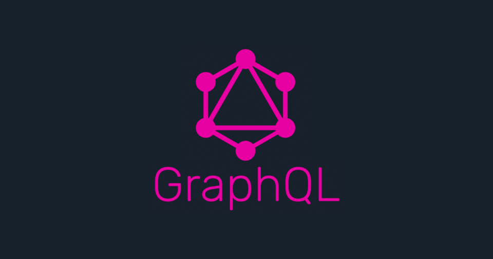

<br>



<br>
GatsbyにおけるGraphQLの挙動について、公式チュートリアル・参考サイトで得られる情報は<br>
順番に学習することを想定しているため、ピンポイントでの理解が難しくなっている。<br>
<br>
差別化のため、この記事では<u><b>何をしたいときにどこを触るか</b></u>という逆引き形式で<br>
GatsbyにおけるGraphQLの使用方法をまとめる。
<br><br>

# GraphQL挙動の前提
基本的には各コンポーネントを構成する.jsファイル内で定義をすることで、Gatsbyの黒魔術で結果が返却される。<br>
おおまかな流れとしては以下になる。<br>
<br>
JSXを生成するコンポーネントを読み込む<br>
↓<br>
queryをexportして読み込んだgraphQLモジュールに投げる<br>
↓<br>
モジュール内部で処理し、結果をdataオブジェクトとしてグローバルに返却<br>
↓<br>
返却されたdataオブジェクトを用いてJSXで表示させる。<br>
<br>

# 用途に応じたGraphQL記法の違い

## テンプレートを使用したページを生成する場合(各記事画面等)
* **gatsby-node.js内部**にクエリを記述し、ビルド時に処理される<br>
* クエリにて取得した値について任意のラベル付けを行い、テンプレートに流し込んでページを生成する<br>
* 複数のページ生成を実施したい場合、各Objectのラベル付けが必要<br>

2個のオブジェクトを生成するクエリを発行 data:{ posts:{ obj }, tags:{ obj } }
<br>

```js
  const result = await graphql(`
    query {
      posts: allMarkdownRemark {              // ①各記事の表示に使用する情報
        edges {
          node {
            frontmatter {
              slug
              tags
            }
          }
        }
      }
      tags: allMarkdownRemark(limit: 1000) {  // ②タグ表示に使用する情報
        group(field: frontmatter___tags) {
          tag: fieldValue
          totalCount
        }
      }
    }
  `)
```
<br><br>

## Topページ等の主ページコンポーネントで情報を取得する場合
* 主コンポーネントでqueryを定義してexportする事により、graphQLモジュールが吸い上げdataオブジェクトを返却する<br>
* queryの定義自体は特に指定箇所は無いが、できるだけ視認性を良くするため間に挟まないようにする<br>

1個のオブジェクトを生成するクエリを発行 data: allMarkdownRemark{ obj }
<br>

```js
export const query = graphql`
  query {
    allMarkdownRemark(sort: { fields: [frontmatter___date], order: DESC }) {
      edges {
        node {
          frontmatter {
            title
            date(formatString: "YYYY年MM月DD日")
            tags
            slug
          }
          excerpt
        }
      }
    }
  }
`
```
<br><br>

## コンポーネントに読み込んだ子コンポーネント内で情報を取得する場合
* 子コンポーネント内でuseStaticQueryを使用する<br>
* exportしているメソッド内でJSXをreturnする形に変更し、return前にqueryを記述する<br>

1個のオブジェクトを生成するクエリを発行 data: allMarkdownremark:{ obj }
<br>

```js
  const data = useStaticQuery(
    graphql`
    query {
      allMarkdownRemark(limit: 1000) {
        group(field: frontmatter___tags) {
          tag: fieldValue
          totalCount
        }
      }
    }
  `
  )

  /* 以下、dataにて取得結果を使用できる */

```
<br><br>

# 未検証
## 親コンポーネントから子コンポーネントへ渡せなくはないと思うが…
子要素の中でgraphQLの結果を使用したい場合、子要素内でクエリ発行を行う方法(useStaticQuery)と<br>
親コンポーネントで生成したqueryから取得したObjectを子要素に渡す方法が考えられる<br>
<br>
SQLと同じ考え方をするのであれば、子要素内でクエリ発行する場合単純化でき保守性が上がるメリットがあり、<br>
親コンポーネントから子要素へ渡す場合はクエリ発行回数が1回以上減らせるメリットがある。<br>
<br>
Gatsbyレベルの動作であればpropsのバケツリレーをするよりクエリ発行してしまったほうが実装が楽なので<br>
親でクエリを複雑にするよりは子コンポーネントを作ってしまったほうが楽じゃないかなと～思う。<br>
(子要素が10-20個とかになるなら発行回数の差がエグいけど、そんなケースなさそうだし)
<br><br>

# まとめ
dataは単数のコンポーネントで取得したい？　→　複数　→　<u>gatsby-node.jsに記述</u><br>
&nbsp;&nbsp;&nbsp;&nbsp;&nbsp;&nbsp;&nbsp;&nbsp;&nbsp;&nbsp;&nbsp;&nbsp;&nbsp;&nbsp;&nbsp;&nbsp;↓<br>
&nbsp;&nbsp;&nbsp;&nbsp;&nbsp;&nbsp;&nbsp;&nbsp;&nbsp;&nbsp;&nbsp;&nbsp;&nbsp;&nbsp;&nbsp;単数<br>
&nbsp;&nbsp;&nbsp;&nbsp;&nbsp;&nbsp;&nbsp;&nbsp;&nbsp;&nbsp;&nbsp;&nbsp;&nbsp;&nbsp;&nbsp;&nbsp;↓<br>
そのコンポーネントはメインのJSXを出力する？　→　NO　→　親コンポーネントの<u>グローバル変数にクエリを記述</u><br>
&nbsp;&nbsp;&nbsp;&nbsp;&nbsp;&nbsp;&nbsp;&nbsp;&nbsp;&nbsp;&nbsp;&nbsp;&nbsp;&nbsp;&nbsp;&nbsp;↓<br>
&nbsp;&nbsp;&nbsp;&nbsp;&nbsp;&nbsp;&nbsp;&nbsp;&nbsp;&nbsp;&nbsp;&nbsp;&nbsp;&nbsp;&nbsp;Yes<br>
&nbsp;&nbsp;&nbsp;&nbsp;&nbsp;&nbsp;&nbsp;&nbsp;&nbsp;&nbsp;&nbsp;&nbsp;&nbsp;&nbsp;&nbsp;&nbsp;↓<br>
子コンポーネントのため<u>useStaticQueryを用いてメインメソッドのローカル変数にクエリを記述</u>