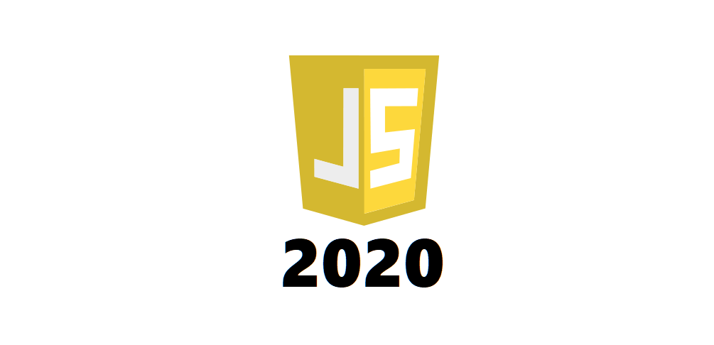

今年はレガシー系SIer企業から転職し、モダン系技術を選択できる会社のエンジニアとして働くことになった。 
設計開発が8:2から現在では2：8 / 1：9ほどの割合になっているため、開発力についてはかなり向上できた。 
インフラ的知識や構造化などの知識も身につけることができたが、基本的にはJavaScript漬けだった。 

また、toBからtoC寄りになったためスケーラビリティや拡張性に意識を置くようになり、 
プロジェクト期間長くなることで身につくスキルが減るかも？という懸念については全く問題なかったと感じる。

今年いくつかのLTで目にした「最新技術はベストプラクティスの集合体」という考え方がすごく良かったため 
新しい技術についてペスプラが固ったら勉強しようという流れから情報はザクザク入れて 
知識として処理していくべきだと強く思った一年だった。 

# 開発
------------------------------------------------------------------------------------------------------------
バックエンド開発についてはexpressを使用したAPIサーバーの作成からwebsocket等を使用した開発ができ、 
一般的なWebアプリバックエンド開発については一通りこなせるようになったと思う。 
 
前職ではVisual Studioに頼り切りでほぼほぼlinuxを触ることはなかったため使えなさによる多少の抵抗感があったが、 
ECS中心の開発もできたためインフラ知識についても業務レベルまで問題なくキャッチアップできたと思う。 
 

* JavaScript / Node.js
    * 業務+個人開発で使用。昨年までの知識と比べて実務でガリガリ書いて本気触りしていたため 
      静的型付け言語と比べて開発の速度感やnpmの便利さに驚いた。
    * 一般参考書レベルで言う中～上級くらいまでは問題なくこなせるようになっているため3月程度を目安に 
      仕様知識が薄い部分やパターンをキャッチアップしていきたい。
    * express、axiosを中心にフロント側もバックエンドも一通してこなせるようになったため、 
      今後は知見のあるモジュールを増やすことや流行をピックしていけるよう知識収集力を高める。(twitterも活用)
    * 珍し目のところだとWebRTCも結構深いところまで触った。datachannel周りが理解できてしまえば汎用性が高いので 
      今後なにか作る際のため時間があったらまとめていきたい。

* React
    * ほぼほぼGatsbyとしての理解。propsリレー関連の知識については乏しいところがあるがHooksが便利みたいなので 
      Nextを触るタイミングでそのへんの知識をつけて行こうと思っている。
    * Gatsbyは基礎レベルなら簡単だがNode.jsとReact力がだんだん必要になる所が勉強教材としての魅力を感じた。

* Docker / ECS
    * おもに業務で使用。
    * スクリプト関連についてはまだ弱いが自宅での学習コストが高いため業務上でキャッチアップしていきたい所。

* Firebase
    * 個人開発のデプロイ先として使用。認証周りが簡単、Cloud Functionが便利と汎用性の高さを感じた。
    * スケーラビリティを考えると個人用途の気が強く、Varcelの存在もあるのでNext知識とトレードオフな感じ。

* GraphQL
    * 基礎的な概念とGatsbyでの挙動について理解。
    * 新規導入や細かい繋込み(バックとつなげる?)等の知識が付けたい所。
    * まだ世間的な利用については薄めなため、他レイヤよりは低優先で取り組む。

* Netlify
    * ホスティングに使用。

 
 

# 2021年にやりたいこと
------------------------------------------------------------------------------------------------------------

## Next.js
2019年のサーバー用モジュールでexpressに次いで二位だったこと、React系フレームワークとして評価が高いことから 
今後他のプロジェクトで採用されたり、使えることがメリットになる可能性が一番高い。 
個人開発SSR用としても文句ないので来年の第一選択肢としておく。 
 

## Go
実行速度だとか並行処理だとかを考えて、Node.jsだと限界な場合に使えるため時勢からもGo一択。 
Nextで作ったWebアプリで叩けるモジュールがCloudFunctionとかで作れれば一番いいと思っている。 

ex.[超エコで超高速なやつらの性能比較: Go vs Node.js (vs Vert.x)](https://qiita.com/LightSpeedC/items/c3537a265fb9f3152f4c) 
 

## 発表会・もくもく等への参加

年の後半になって少しずつ企業が開催しているオンライン発表会を見るようになったが流行がわかったり、 
キャンペーン的なメリットもあったため、できるだけ参加しておくと良いと感じた。 
なんにせよモチベーションが上がること・メリハリが付くこともあるためできるだけ参加していくようにしたい。 
 
   
「常に新しいことに挑戦する」という目標を掲げ、公私ともに新しいことができた一年だった。 
色々と余裕を持って勉強できたため、2021年は将来を見据えた学習を進めていきたい。