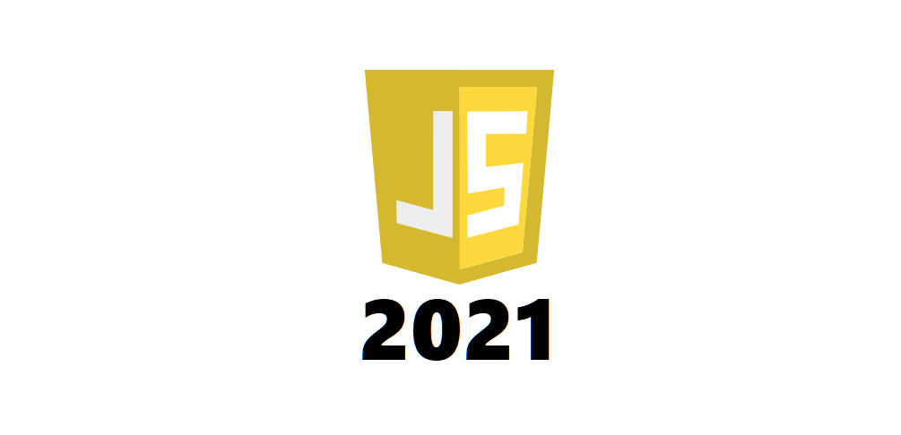
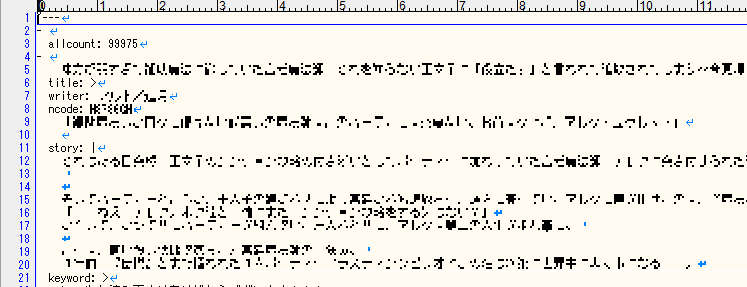

年度替わりの3月までに基礎固めをしようと思ったため、2021年現在でJavaScriptを学ぶために 
最短アプローチはどうすればよいか？を振り返りと方針がためを含め纏めました。 

* 勉強するドキュメントについて
* とりあえず書いて覚える ※0からの学習者向け
* 書いて覚えるフェーズが終わったら？
* "とりあえず"書いたコードをES6以降実装の機能を使って修正する　※0からの学習者向け

 

# 勉強するドキュメントについて
------
JavaScript系の学習情報を検索すると、大きく分けて以下3種の記事が存在します。 
 
1.フロントエンドJavaScript(動きに関わる処理) 
2.フロントエンドJavaScript(情報取得等、バックエンドとつなぐ処理) 
3.バックエンドJavaScript(API・内部処理作成等フロントエンドとつなぐ処理) 
 
現在ネット上に存在する情報は2015年以前の仕様からES6周りの記事が9割ほどであり、 
他の言語よりも注意して「いつの情報を勉強しているか？」を確認する必要が出てきます。 
 
地雷記事を避けるために特に理由なくvarを使っていたり(※1)、文頭が$で始まっているコード(※2)は 
古い仕様であることが多いので、しっかり投稿時期を確認してから勉強するのが重要です。
  
※1：ES6からconst, letが追加されvarは非推奨のため 
※2：html埋め込みで書いていた時期の物が多い、今はwebpack等で複数モジュールを纏めて1ファイルで 
　　&nbsp;&nbsp;読み込むことが普通なため、html埋め込み＝古い可能性は非常に高い
   
結論から言うと、現在のJavaScript開発環境はWebpack等のバンドラを99%使用することから、 
<u>**NodeJSの記法でコンソールアプリを作りJavaScriptを書けるようになる**</u>ことが最速かつ一貫性があります。 
 
NodeJSについてはバックエンドのJavaScriptとして扱われがちですが、フレームワーク・モジュールの 
組み合わせができ便利度が上がること、バンドラの存在、トランスパイラの存在からNodeJSが書ければ 
JavaScriptの現場に行っても一切困ることはありません。 
 
参考：[【JavaScript】なろうランキングをAPIで一括取得する](https://sena-v.com/narou-rank-get)、
[Node.js でコンソールアプリを作る](https://susisu.hatenablog.com/entry/2016/12/21/145611) 

とは言っても本気で0からの場合記法もわからないと思うので、[JavaScript初級者から中級者になろう](https://uhyohyo.net/javascript/)の 
1~5+9章を1日で終わらせ、1週間以内で設計からコーディングまでできるレベルのコンソールアプリを 
考えて作りましょう。  

## ECMAScriptに注意、2015年以降のドキュメントを利用しろ
------------------------------------------
初学習～中級くらいまでJavaScriptに関して本で勉強するのはマジでおすすめしません。 
自分が一通りJavaScrtiptを勉強をした上で、中上級向けと言われているブレイクスルーJavaScriptを読んだ際 
以下の感想を持ちました。 

* ES5対応の本のため、内容がかなり古くなっている
* JavaScript中級程度の内容が2割、他はレガシー気味なモジュール関連の話
* いま新品で買うほどの内容ではない、開眼JavaScriptの内容で必要十分かも

古本で安く買えたのでサラッと読もうと思っていましたが、JavaScriptに直接関係する現在でも使える箇所は 
全体の2割程度であり、情報の取捨選択ができない学習者は現在では使えなくなっている技術について 
フィルタリングできず全て勉強して時間を無駄にする可能性が高いです。 

もし本で勉強する場合、ECMAScript2016以降の情報が正確に乗っている物であればES6の内容についても 
ある程度熟れて信用できるため、「この本はECMAScriptXXXXに準拠しています」という記述を目安に選んで下さい。 
 

# とりあえず書いて覚える
------------------------------------------
勉強ドキュメントについて理解し、一通りJavaScriptの記法を学んだらコンソールアプリ作成に移ります。 
 
細かいイメージについては自分で考えて作ることが重要ですが、**外部モジュールは1個以上使用すること**、 
**長くとも1週間で完成する物にすること**、可能な限り他人のコードを参考に**しない**ことを注意してください。 
 
短すぎるものを使っても意味がないので、なにか情報をとってくる→中で処理する→出力する的なものが 
行数的にもちょうどよいと思うので、nodeのfsモジュールと+αでなにか作るのが丁度いいと思います。 

※自分はAPIで情報取得を実施し、内部で処理、textを出力するコンソールアプリを作成しました。 
参考：[【JavaScript】なろうランキングをAPIで一括取得する](https://sena-v.com/narou-rank-get)
  

 

# 書いて覚えるフェーズが終わったら
------------------------------------------

## ES6からES8の機能を復習する

おそらく情報の寄せ集めで書いたコードや現場のコードについてはES6以降で実装されたメソッドを使用した 
物が多く存在しており、便利使えることからどんな機能が存在するか、それぞれのメソッドをどんなシーンで 
使用すると便利なのかを改めて学習します。 
 
プロジェクトに自分よりシニアな人間がいた場合、これらのメソッドの使い方が上手だったり、 
新しい概念を導入していたりするので差を感じがちですが、この辺をうまくキャッチアップしつつ、 
仕様的な部分についても理解することでNodeJSのレベルを引き上げることができます。 
 
ESごとの追加機能について：[とほほのJavaScriptリファレンス:JavaScript って何？](http://www.tohoho-web.com/js/what.htm)

## 初期～改修まで使える基礎的な部分の知識

* class分割、構造化などリファクタリング知識
* 無駄なループを使っていないか
* グローバルスコープの正常化、クロージャ化

## 初~中級だとあまり触れられていないが現場で必須だと思うところ
* コールバックと非同期処理関連の記法
* functionとアロー関数の振る舞いの違い
* プロトタイプチェーンとイベント駆動型処理
* this関連(振る舞い、bind等)

## 更に発展(コードから離れ他部分も含めて)
* シェアが高いモジュールの知識、トレンドの把握
* バンドラ・トランスパイラの知識
* 仕様関連の知識(2015年以前の本も利用する)

自分では発展知識の3点が足りていないと思っているのでこれから強化していこうと思っている。 
特に仕様周りとかは実装時に修正の速度があがったり、モジュールの組み合わせ時のデバッグで 
<u>仕様を理解していないと解決できないようなものが出てくることがある</u>ため、学び得な部分になります。 
 
「2015年以前の本についてはおすすめしない」と書きましたが、仕様について書かれているオライリーや 
発展型の書籍については2015年以前のものがほとんどであり、最近発展型の内容を書いている開発者は 
TypeScriptへ移行していることからあまりいい書籍が出ていないのが現状です。(良いものがあったら教えて) 
 
オライリーのサイ本が仕様含めた学習用として一番良いですが、第6版が2012年08月発行で内容が古いため 
即買いするなら2020年6月に出たJavaScript 7thの日本語訳を待ってから勉強しても良いような気はします。 
(スパン見た所一年半後くらいで日本語訳が出てたので、2021年11月くらいには日本語版が出ると思います)
  
とはいえエンジニアにとってスキルありなしの差は一年でかなり大きくなるため、Effective JavaScriptや 
開眼JavaScript等既存の本で勉強できる箇所は吸収するようにしましょう。 
 

<a href="https://www.amazon.co.jp/%E9%96%8B%E7%9C%BC-JavaScript-%E2%80%95%E8%A8%80%E8%AA%9E%E4%BB%95%E6%A7%98%E3%81%8B%E3%82%89%E5%AD%A6%E3%81%B6JavaScript%E3%81%AE%E6%9C%AC%E8%B3%AA-Cody-Lindley/dp/487311621X/ref=as_li_ss_il?__mk_ja_JP=%E3%82%AB%E3%82%BF%E3%82%AB%E3%83%8A&crid=KQGPAWCZMPN&dchild=1&keywords=%E9%96%8B%E7%9C%BC+javascript&qid=1609700068&sprefix=%E3%81%8B%E3%81%84%E3%81%8C%E3%82%93%2Caps%2C297&sr=8-1&linkCode=li3&tag=sena0c9-22&linkId=68de17155cfeb70eefbc7a3abbdddd50&language=ja_JP" target="_blank"></a>

  

## 「最新のフレームワーク」でベスプラを学ぶ
最新技術の粋を集めたフレームワークについてはコントリビューターもトップ層が多く、チュートリアル等で 
生成されたソースコードを読むだけでも勉強になります。複数のモジュールを組み合わせコンソールアプリを 
完成させた後は書きまくって覚えることが重要なので、可能な限りフレームワーク機能内で完結できるような 
アプリケーションを作成するのが一番理解が早く深まります。 
 
ここで欲張って複数モジュールを組み合わせ・DB等を組み合わせて良いものを作ろう！としても 
初速が出ないため、勉強として実施する場合はJS以外の要素を組み合わせることをおすすめしません。 
組み合わせモジュールが多くなればなるほどデバッグ等で必要のない時間を使ってしまう可能性も多いので、 

* コンソールアプリで組み合わせの基礎を学ぶ(1週程度)
* フレームワークのみで完結するものを作り基礎を学ぶ(todoくらい、1週程度)
* フレームワークにモジュールを組み合わせてプロダクトを作る

以上の順に進めていけば1ヶ月以内に基礎的な部分は問題なく身につくと思います。 
  
※自己学習について一番ネックなのは時間をどう取るかという部分ですが、移動時間等でも文法などは 
　身につくと思うので、できるだけコーディングまでにどんな構造で、変数をどうするか等を考えておき、 
　勉強時間＝コードをフルで書く時間くらいにできるようにしましょう。そこで出てきたエラー等については 
　勉強時間以外にでも調べられるため、PCに向かっている時間を調査で消費しないようにしましょう 
 

# コードをES6以降実装の機能を使って修正する
------------------------------------------
ES6以降の知識を入れた後、自分がとりあえず作ったモジュールを見返し、勉強した範囲で直せそうだと 
思った箇所を新しい機能を使って修正します。とりあえず書いて覚える、のフェーズで情報の取捨選択が 
うまく出来ていればここに関して修正することは無いと思います。(自己採点みたいなフェーズになります) 

* 繰り返し処理関連の機能を使って置き換える
* 一部処理をわざとクラス化して別モジュールから呼び出してみる

フレームワークでベスプラを学ぶ部分と既存コード修正どちらを優先とするかは状況次第ですが、 
転職が必要等、社内でのJavaScript現場移動が難しい場合は個人開発からポートフォリオにすすめるため 
フレームワークを優先してもいいと思います。特に急ぎでない場合は自分で書いたコードのリファクタで 
おそらくかける時間は大したこと無い割に得られる事がデカい(仕様知識の復習・メソッド理解)ため、 
できるだけ修正フェーズを挟むことをおすすめします　※見直しレベルになるので一日くらいで終わらせる 
 

# まとめ
----------
JavaScriptについては用途が長い歴史の中で変わってきているため、抑える箇所をちゃんと押さえないと 
意味ないどころか無駄な時間を使ってしまうため、2015年以前の本を参考にしすぎないことを理解した上で 
* できるだけ今の知識で書いてみる
* 差を意識した状態でES6以降の仕様を学ぶ
* フレームワークかリファクタリングで復習する

以上の3フェーズで無駄をなくした学習を進めることができます。 
特に今自分がJavaScriptだと思っているものがいつのバージョンか？を理解することが一番重要なので 
しっかりと意識しながら勉強をすすめるようにしましょう。

# 追記
-----

<blockquote class="twitter-tweet" style="text-align:center">
- TypeScript のチュートリアルをやる<a href="https://t.co/YyaC6C8rSe">https://t.co/YyaC6C8rSe</a> - Next.js のチュートリアルをやる <a href="https://t.co/xMMVvzHwK5">https://t.co/xMMVvzHwK5</a> - <a href="https://t.co/RH5SgCGNIJ">https://t.co/RH5SgCGNIJ</a> と <a href="https://t.co/rffxTL9zui">https://t.co/rffxTL9zui</a> を読んで、面白そうなライブラリをひたすら手元で試してみる - クラウドなにか一つ決めて勉強する。Firebase,AWS,GCP
&mdash; OSSタダ乗りおじさん (@mizchi) <a href="https://twitter.com/mizchi/status/1346313712785707009?ref_src=twsrc%5Etfw">January 5, 2021</a></blockquote> 

@mizchiさんの投稿にもありましたが、やはり大枠はnodeからReact等が一番良さそうです。 
といっても「基本を身に着けてからReactをうまく扱えるか？」の部分が最初の難関となるので 
ネット上の講座等も<u>ES6以降が学べるか精査した上で</u>身につけると最短速度で学習が進むと思います。
